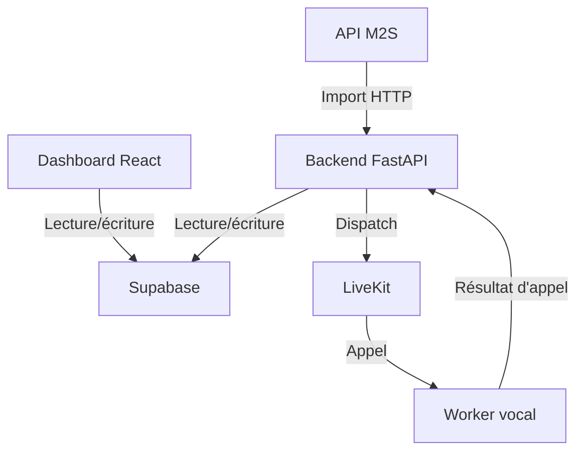

# Analyse complète du projet Vigie M2S

Date de contrôle : 16 juillet 2026

## 1. Conclusion générale

Le frontend React et le backend FastAPI fourni séparément sont cohérents pour les nouveaux champs, à condition qu'ils utilisent exactement le même projet Supabase et que la nouvelle migration soit appliquée.

La connexion n'est toutefois pas une connexion HTTP directe : le frontend n'appelle pas les routes `/api/*` du backend. Il lit et écrit directement dans Supabase, tandis que le backend lit et écrit dans les mêmes tables via `SupabaseRepo`. Cette architecture indirecte permet bien au dashboard de piloter les paramètres consommés par le backend.

Verdict fonctionnel : **oui pour le flux partagé par Supabase**, après migration. Le build frontend et le contrôle TypeScript passent. La version 0.3 du backend protège désormais les routes internes par clé d'API, vérifie la signature Meta des webhooks WhatsApp et corrige la lecture du numéro WhatsApp sélectionné.

## 2. Modifications intégrées

### Paramètres « Agent vocal & LiveKit »

- Ajout des huit colonnes demandées à `settings`, par migration idempotente.
- Extension du type TypeScript `Settings`.
- Mapping bidirectionnel camelCase ↔ snake_case.
- Ajout de la Card « Agent vocal & LiveKit » juste après « Téléphonie IA (SIP) ».
- Conservation du bouton global « Enregistrer » et du pattern `useSettings` / `useUpdateSettings`.
- Valeurs initiales : chaînes vides et limites `60 / 200 / 6`.

### Informations M2S du dossier

- Ajout de `assure`, `vehicule` et `date_sinistre` à `dossiers`.
- Extension du type `Dossier` et des types Supabase générés.
- Mapping lecture et mise à jour des huit informations éditables.
- Correction des requêtes dossier : les cinq champs déjà mappés n'étaient pas inclus dans les clauses `select`, donc ils ne pouvaient pas réellement s'afficher auparavant.
- Ajout de la carte « Informations complémentaires » avec affichage stable de « — » pour les valeurs absentes.
- Ajout du formulaire « Modifier » pour les trois nouveaux champs et les cinq champs existants.
- Affichage français de la date du sinistre.

### Dossiers validés

Le tableau affiche désormais exactement :

| Réf. sinistre | Assuré | Assurance | Matricule | Lieu du sinistre | Validé le |
|---|---|---|---|---|---|

Les filtres temporels, la pagination, le filtre de zone et l'ouverture du détail depuis une ligne sont conservés. La recherche couvre aussi les nouvelles valeurs affichées.

## 3. Correspondance frontend ↔ Supabase ↔ backend

### Paramètres vocaux

| Frontend | Colonne Supabase | Consommateur backend |
|---|---|---|
| `livekitUrl` | `livekit_url` | Dispatch LiveKit dans `app/providers/telephony.py` |
| `livekitApiKey` | `livekit_api_key` | Dispatch LiveKit |
| `livekitApiSecret` | `livekit_api_secret` | Dispatch LiveKit |
| `openaiApiKey` | `openai_api_key` | Transmis au worker pour OpenAI Realtime |
| `vigieApiBaseUrl` | `vigie_api_base_url` | URL de retour du résultat d'appel |
| `agentMaxCallSeconds` | `agent_max_call_seconds` | Coupure dure du worker |
| `agentMaxResponseTokens` | `agent_max_response_tokens` | Limite de tokens par réponse |
| `agentMaxTurns` | `agent_max_turns` | Limite de tours de parole |

### Dossier M2S

| Frontend | Colonne Supabase | Import backend M2S |
|---|---|---|
| `assure` | `assure` | `assuré`, `assure` ou `nom_assure` |
| `vehicule` | `vehicule` | `vehicule` ou `véhicule` |
| `matricule` | `matricule` | `matricule` |
| `adresse` | `adresse` | `lieu_sinistre`, `adresse` ou `lieu` |
| `zoneDossier` | `zone` | Extraction heuristique depuis le lieu |
| `dateSinistre` | `date_sinistre` | `date_sisnistre`, `date_sinistre` ou `date_du_sinistre` |
| `nomAssurance` | `nom_assurance` | `nom_assurance` ou `assurance` |
| `numTelClient` | `num_tel_client` | Champ optionnel si M2S le fournit |

Le backend séparé fourni contient déjà les modèles, schémas Pydantic, imports et accès Supabase correspondant à ces colonnes. Aucun fichier Python n'a été modifié.

## 4. Contrôles réalisés

- `npm ci --dry-run` : succès après réalignement du lockfile avec `package.json`.
- `npm run build` : succès, build client, SSR et Nitro généré.
- `npx tsc --noEmit` : succès, aucune erreur TypeScript.
- ESLint ciblé sur tous les fichiers TypeScript modifiés : aucune erreur et aucun avertissement.
- Vérification des différences et espaces : succès.
- Analyse syntaxique statique de l'ensemble des fichiers Python du backend : aucune erreur de syntaxe.
- Contrôle manuel des flux `settings`, import M2S, LiveKit, worker vocal, résultats d'appel et WhatsApp.

Le lint global du dépôt initial reste pollué par des fins de ligne Windows CRLF sur de nombreux fichiers non modifiés. Les fichiers modifiés ont été normalisés et passent le lint ciblé.

## 5. Points critiques avant production

### 5.1 Secrets exposés au navigateur — critique

`livekit_api_secret` et `openai_api_key` sont stockés dans `settings`. La policy existante permet aux rôles `admin` et `superviseur` de lire cette ligne. Comme le frontend interroge directement Supabase avec `select('*')`, tout utilisateur autorisé peut récupérer les secrets depuis l'onglet Réseau ou la console, même si les champs utilisent `type="password"`.

Le backend transmet également la clé OpenAI dans les métadonnées du dispatch LiveKit. Une clé secrète ne devrait pas circuler dans des métadonnées de salle ou d'appel.

Recommandation : conserver les secrets dans un coffre de secrets côté serveur, ne stocker dans `settings` que des identifiants ou des valeurs non sensibles, et exposer une opération backend qui accepte une nouvelle valeur sans jamais renvoyer la valeur courante.

### 5.2 Authentification des routes FastAPI — corrigé dans la version 0.3

Les routes internes des routeurs dossiers, appels, paramètres, KPI et moteur exigent maintenant `VIGIE_API_KEY`, transmise par `X-API-Key` ou `Authorization: Bearer`. Si la clé serveur est absente, les routes restent verrouillées avec une erreur 503 ; une mauvaise clé renvoie 401. Le worker envoie cette même clé lorsqu'il poste un résultat d'appel.

Le webhook WhatsApp ne peut pas utiliser cet en-tête personnalisé : il vérifie désormais la signature officielle `X-Hub-Signature-256` avec `WHATSAPP_APP_SECRET`. La route de santé `/` reste publique. `ENGINE_TICK_TOKEN` peut rester activé comme seconde protection du tick.

### 5.3 Incompatibilité du schéma SQL v2 fourni — critique si exécuté

Le fichier `schema_m2s_v2_postgresql.sql` est une proposition normalisée distincte du schéma réellement utilisé. Il introduit notamment `nom_assure`, `lieu_sinistre`, `status_code`, `stage_id`, des tables de référence et des vues, alors que le frontend et le backend actuels attendent `assure`, `adresse`, `status`, `stage`, ainsi que les enums et tables des migrations Supabase existantes.

Il est donc inclus dans l'archive comme **schéma de référence**, pas comme migration à exécuter sur la base actuelle. L'exécuter tel quel à côté du schéma existant provoquerait des conflits de tables et casserait les contrats applicatifs.

### 5.4 Contact WhatsApp sélectionné — corrigé dans la version 0.3

`SupabaseRepo.get_whatsapp_contact()` lit maintenant `number_whatsapp`, avec un repli sur `numero` pour préserver la compatibilité avec une éventuelle base locale historique. Le contact choisi dans le dashboard est donc correctement utilisé en production Supabase.

### 5.5 Services longue durée et déploiement serverless — important

Le moteur d'escalade, le poller M2S et le worker LiveKit sont des processus longue durée. Un déploiement purement serverless, par exemple Vercel Functions, ne garantit pas leur exécution continue.

Recommandation : déployer l'API et le moteur sur Render, Railway, Fly.io, un conteneur ou une VM persistante ; exécuter le worker LiveKit comme service séparé ; ou déclencher le moteur par un cron externe protégé.

Le changement de `LIVEKIT_URL`, `LIVEKIT_API_KEY` ou `LIVEKIT_API_SECRET` depuis le dashboard affecte le dispatch backend, mais ne reconnecte pas un worker déjà démarré à un autre projet LiveKit. Le worker doit conserver ses propres variables et être redémarré si le projet LiveKit change.

## 6. Points importants mais non bloquants

- Les filtres texte et zone de la page « Dossiers validés » sont appliqués après la pagination Supabase. Ils ne recherchent donc que dans la page courante, et le total affiché reste le total non filtré.
- Les garde-fous numériques ont des valeurs par défaut mais aucune contrainte SQL `CHECK`. Un client Supabase autre que l'interface peut écrire des valeurs invalides.
- L'API M2S mappe actuellement `ref_sinistre` vers `ref_m2s`. Le schéma normalisé fourni les considère comme deux références distinctes. Il faut confirmer la règle métier avant une future migration de données.
- L'extraction de zone est une heuristique basée sur une liste de villes présentes dans le texte du lieu. Une adresse ambiguë ou une ville absente de la liste donnera une zone vide.
- Une date M2S invalide est convertie en `null` sans remonter d'erreur métier.
- Aucun test automatisé frontend/backend n'est présent pour verrouiller les mappers, les permissions et le workflow d'appel.

## 7. Ordre de mise en service recommandé

1. Appliquer toutes les migrations Supabase du dossier `frontend/supabase/migrations`, dans l'ordre, jusqu'à `20260716020000_agent_vocal_livekit_et_donnees_m2s.sql`.
2. Vérifier que la ligne `settings.id = 1` existe.
3. Déployer le frontend avec `VITE_SUPABASE_URL` et `VITE_SUPABASE_PUBLISHABLE_KEY` du même projet Supabase.
4. Déployer le backend fourni avec `USE_SUPABASE=true`, les mêmes URL/clé publique Supabase et un compte de service ayant le rôle `admin`.
5. Générer `VIGIE_API_KEY`, placer la même valeur dans l'environnement du backend et du worker, puis configurer `WHATSAPP_APP_SECRET` avec l'App Secret Meta.
6. Déployer le worker LiveKit séparément avec ses variables LiveKit de démarrage.
7. Renseigner les valeurs de test depuis `/parametres`.
8. Importer un dossier M2S de test contenant tous les champs, avec l'en-tête `X-API-Key`.
9. Vérifier la page détail, la modification des huit informations et le tableau des dossiers validés.
10. Déclencher un appel de test en mode mock, puis un appel LiveKit réel.
11. Vérifier le retour du résultat, la transcription, la validation et l'escalade WhatsApp.

## 8. Structure de l'archive finale

- `frontend/` : frontend React modifié et migrations Supabase.
- `vigie-backend/` : backend séparé fourni, repris sans modification.
- `database/schema_m2s_v2_postgresql.sql` : schéma normalisé fourni, conservé comme référence.
- `ANALYSE_PROJET_VIGIE_M2S.md` : le présent rapport.
